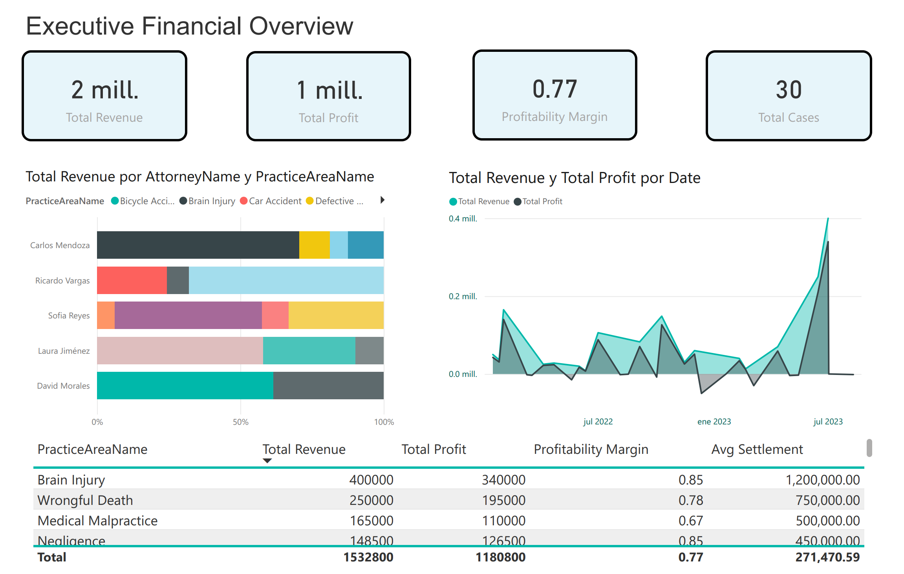
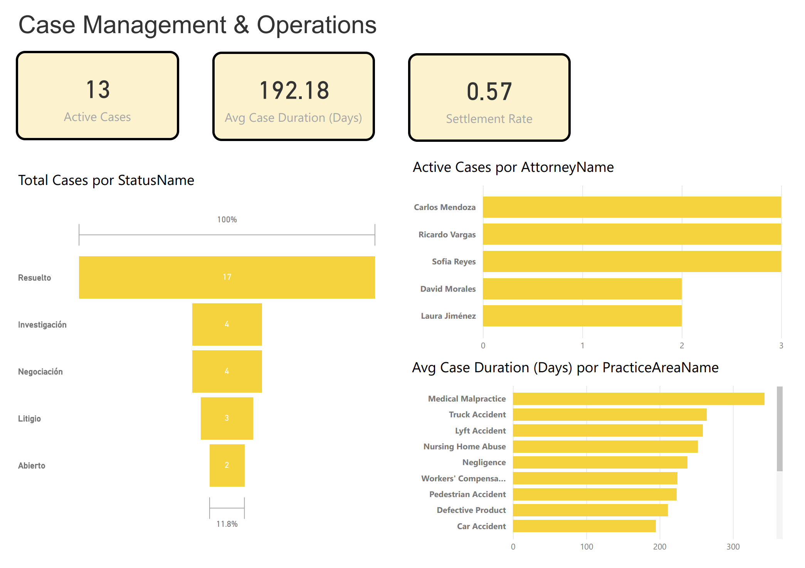
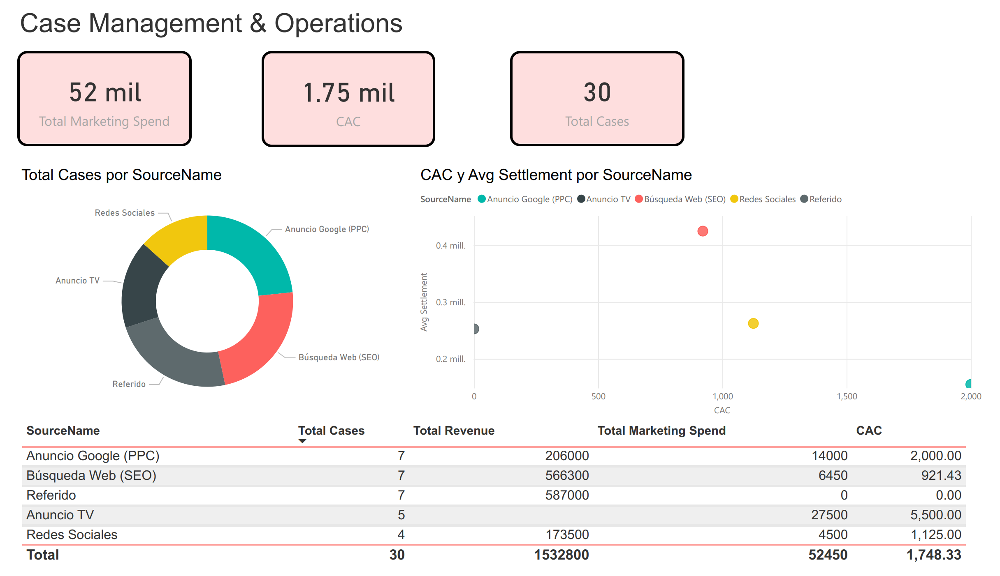
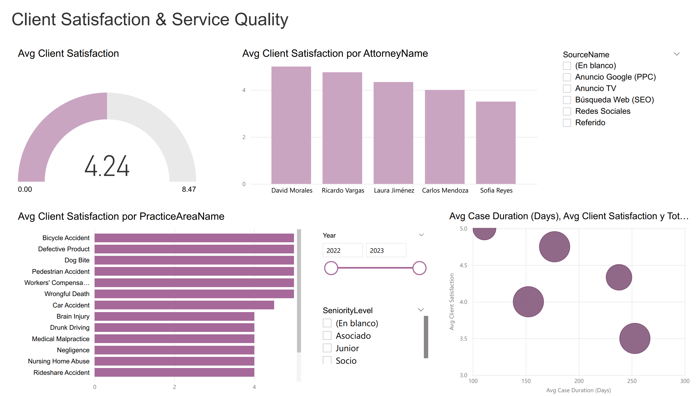

# Law-Firm-Performance-Analytics
This project simulates a complete Business Intelligence (BI) solution for a personal injury law firm. As the BI Developer/Analyst, I designed and built an end-to-end analytics dashboard in Microsoft Power BI to provide the firm's leadership with a 360-degree view of their operations.

# End-to-End Law Firm Performance Dashboard in Power BI

**Author:** [Alonso Villalobos]  
**LinkedIn:** [https://www.linkedin.com/in/alonso-villalobos-lara-7297641b/]  
---

## 🚀 Project Summary

This repository documents the end-to-end creation of a comprehensive Business Intelligence solution for a fictional personal injury law firm. The project's goal was to move the firm from a state of scattered, raw data to a centralized, interactive analytics ecosystem.

As the sole BI Developer, I was responsible for the entire project lifecycle: from defining business requirements and preparing the data, through ETL, data modeling, DAX measure creation, and finally, designing a suite of four strategic dashboards in **Microsoft Power BI**. This project showcases a deep understanding of both the technical BI stack and the specific business drivers of a professional services firm.

## 🎯 The Business Problem & Strategic Goals

The law firm's leadership faced a common but critical challenge: a lack of data-driven visibility into their operations. Their data was fragmented across various systems (case management software, accounting spreadsheets, marketing reports), making it impossible to answer fundamental strategic questions:

1.  **Financial Performance:** Which types of cases are truly the most profitable after accounting for expenses? Are certain attorneys consistently generating more revenue?
2.  **Operational Efficiency:** What is the average time it takes to resolve a case? Where are the bottlenecks in our case lifecycle? Is our attorney workload balanced?
3.  **Marketing Effectiveness:** What is our Return on Investment (ROI) for marketing campaigns? Which channels bring in the most valuable clients, not just the most leads?
4.  **Client Satisfaction:** How can we quantitatively measure client happiness? Is there a link between how we operate and how clients feel about our service?

The goal was to build a "single source of truth" to answer these questions and empower data-informed decision-making at every level of the firm.

## 🛠️ My Step-by-Step Development Process

I followed a structured BI development methodology, broken down into distinct, logical phases.

## Phase 1: Data Sourcing & Preparation

To build a realistic prototype, I first defined the necessary data entities and then generated sample datasets. The data was structured to mirror what a real law firm would produce.
The following tables were created as CSV/Excel files:
Fact_Cases: The central transactional table containing one row per legal case, with all key metrics.
Dim_PracticeArea: A lookup table for case types (e.g., "Car Accident", "Medical Malpractice").
Dim_Attorney: A lookup table for attorneys and their seniority.
Dim_CaseStatus: Describes the stages of a case lifecycle (e.g., "Open", "Negotiation", "Settled").
Dim_LeadSource: A lookup table for marketing channels.
Dim_Client: A list of clients.

Fact_Cases Data Snippet:
CaseID	ClientID	LeadAttorneyID	PracticeAreaID	StatusID	LeadSourceID	DateOpened	DateClosed	SettlementAmount	LegalFees	CaseExpenses	MarketingSpend	ClientSatisfactionScore
1001	101	1	1	5	3	2022-01-15	2022-08-20	150000	50000	7500	1500	5
1002	102	2	4	5	1	2022-02-01	2023-01-10	500000	165000	25000	0	4

## Phase 2: ETL - Extract, Transform, Load

The ETL process was performed exclusively within Power Query inside Power BI, demonstrating my ability to handle data preparation without external tools.
Extract: I connected Power BI to the local CSV/Excel files.
Transform: This was the most critical data preparation phase:
Schema Definition: I checked and corrected the data types for all columns upon ingestion (e.g., ensuring DateOpened was a Date type and LegalFees was a Fixed Decimal Number).
Data Quality Profiling: I used Power Query's built-in tools (Column Quality, Column Distribution) to scan for potential errors, inconsistencies, or blank values.
Calculated Columns (as needed): Although not heavily needed for this dataset, this is where I would create new columns based on existing data (e.g., extracting a year from a date).
Generated Date Dimension: I created a dedicated Dim_Date table using a DAX script. This is a BI best practice that is fundamental for time-intelligence analysis (e.g., Year-over-Year comparisons).
Load: The cleaned and transformed tables were then loaded into the Power BI data model.

## Phase 3: Data Modeling

A well-structured data model is the foundation of any high-performing BI solution. I designed a Star Schema to optimize for analytical queries and ease of use.
The Fact_Cases table serves as the central fact table.
All Dim_ tables serve as the dimensions, connected to the fact table via one-to-many relationships.
This classic design separates descriptive attributes from measurable facts, resulting in faster query performance and a more intuitive structure for creating visuals and writing DAX.

## Phase 4: DAX Implementation

With the model in place, I authored a series of DAX (Data Analysis Expressions) measures to embed the firm's business logic directly into the model. This is where raw data becomes true intelligence.
Key Financial Measures Created:

### Generated dax
// Calculates the firm's overall profit after all case-related expenses.
Total Profit = SUM(Fact_Cases[LegalFees]) - SUM(Fact_Cases[CaseExpenses])

### // Calculates the profit margin, a crucial indicator of financial efficiency.
Profitability Margin = DIVIDE([Total Profit], [Total Revenue], 0)

### Key Operational Measures Created:
Generated dax
// Dynamically counts only the cases that are not yet settled or closed.
Active Cases = CALCULATE(COUNT(Fact_Cases[CaseID]), Dim_CaseStatus[StatusName] IN {"Abierto", "Investigación", "Negociación", "Litigio"})

### // Calculates the average time from opening a case to its resolution.
Avg Case Duration (Days) = 
AVERAGEX(
    FILTER(Fact_Cases, NOT ISBLANK(Fact_Cases[DateClosed])),
    DATEDIFF(Fact_Cases[DateOpened], Fact_Cases[DateClosed], DAY)
)
These measures are reusable, scalable, and ensure that every visual in the report is based on a single, centrally defined truth.

## Phase 5: Visualization & Dashboarding

The final phase was to design a 4-page report where each page serves as a dedicated dashboard for a specific strategic area. The design philosophy was to present information in a "top-down" manner, starting with high-level KPIs and allowing users to drill down into details.

## 📊 Dashboard Showcase

### Dashboard 1: Executive Financial Overview

Purpose: To provide partners with a clear, high-level view of the firm's financial health.
Strategic Questions Answered: How are we performing against our financial goals? Who are our most profitable attorneys and what are our most profitable case types?

### Dashboard 2: Case Management & Operations

Purpose: To give operational leads insight into case flow, efficiency, and attorney workload.
Strategic Questions Answered: Where are our operational bottlenecks? Is our staff's workload balanced? How long does it take us to settle different types of cases?

### Dashboard 3: Marketing & Client Acquisition

Purpose: To measure the effectiveness and ROI of marketing efforts.
Strategic Questions Answered: Which marketing channels are driving the most valuable clients? What is our client acquisition cost (CAC) and how does it compare across channels?

### Dashboard 4: Client Satisfaction & Service Quality

Purpose: To quantify client happiness and link it to operational performance.
Strategic Questions Answered: How satisfied are our clients, on average? Are certain attorneys or case types associated with higher satisfaction? Does resolving a case faster make clients happier?

## 💡 Key Skills & Technologies Demonstrated

**Business Intelligence**: End-to-end project execution from conceptualization to deployment.
**Technical Stack**: Power BI, Power Query (M Language), DAX.
**ETL**: Proficient in data extraction, robust data transformation, data cleaning, and data loading best practices.
**Data Modeling**: Expert in designing and implementing performant Star Schemas for analytics.
**Advanced DAX**: Ability to write complex, context-aware measures that encapsulate critical business logic.
**Data Visualization & UI/UX**: A strong eye for designing dashboards that are not only visually appealing but also intuitive, insightful, and actionable.
**Business Acumen**: Demonstrated ability to understand the specific needs of a professional services business and translate them into technical BI solutions.
